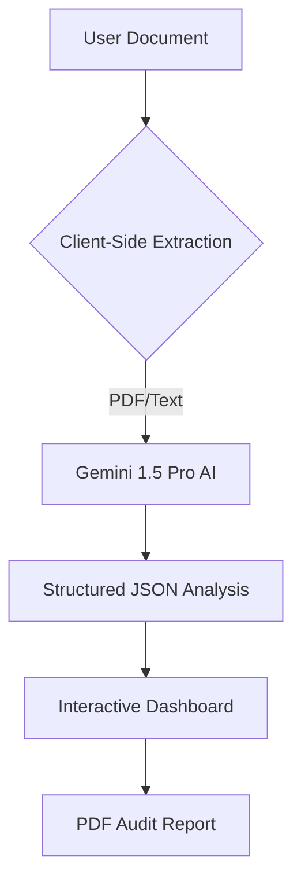

# SwissGuard AI - Smart Contract & Legal Auditor

Professional tool for auditing smart contracts and legal documents using Gemini AI.

---
**Available Languages:**
[🇺🇸 English](./README.md) | [🇮🇹 Italiano](./README_IT.md) | [🇩🇪 Deutsch](./README_DE.md) | [🇫🇷 Français](./README_FR.md)
---

## 🛡️ Overview
SwissGuard AI provides institutional-grade analysis for legal documents and blockchain smart contracts. It identifies critical risks, compliance gaps, and suggests technical fixes in real-time.

## 📊 System Architecture


## ✨ Key Features
- **Multi-language Support**: Interface and analysis available in English, Italian, German, and French.
- **Smart Detection**: Automatically distinguishes between Legal Documents and Smart Contracts.
- **Compliance Engine**: Checks against international standards (GDPR, FINMA, etc.).
- **Risk Scoring**: Visual risk assessment from 0 to 100.
- **Exportable Reports**: Professional PDF generation for institutional use.

## 🚀 Getting Started

Follow these instructions to get a local copy up and running.

### Prerequisites
- **Node.js**: Version 18.0 or higher.
- **npm**: Usually comes with Node.js.

### Installation
1. **Clone the Repository**:
   ```bash
   git clone https://github.com/your-username/SwissGuardAI.git
   cd SwissGuardAI
   ```
2. **Install Dependencies**:
   ```bash
   npm install
   ```

### Configuration (API Key)
To use the AI auditing features, you need a Google Gemini API Key.
1. Obtain a free API key from the [Google AI Studio](https://aistudio.google.com/app/apikey).
2. Create a file named `.env` in the root directory of the project.
3. Add your API key to the file:
   ```env
   GEMINI_API_KEY=your_actual_api_key_here
   ```

> [!NOTE]
> **Free vs Advanced Version**: 
> - The **Free Version** uses the API key provided in the `.env` file.
> - The **Advanced Version** (in the AI Studio environment) allows you to select different keys through the platform's UI. For local use, both versions will use the key from your `.env` file.

### Running the App
Start the development server:
```bash
npm run dev
```
Open your browser and navigate to `http://localhost:3000`.

## 🚀 How to Use
1. **Select Language**: Choose your preferred language from the top-right globe icon.
2. **Upload Document**: Drag and drop your PDF or source code file (.sol, .txt) into the upload area.
3. **AI Audit**: The system will automatically extract text and perform a deep analysis.
4. **Review Results**:
   - **Risk Score**: Check the overall security level.
   - **Compliance**: Verify regulatory alignment.
   - **Critical Issues**: Review specific clauses and suggested fixes.
5. **Download Report**: Click the "Download Report" button to save a professional PDF summary.

## 🛠️ Technical Details
- **Frontend**: React 19, Tailwind CSS, Motion.
- **AI**: Google Gemini 1.5 Pro.
- **PDF Engine**: Client-side PDF.js (bypasses iframe cookie restrictions).
- **Security**: No server-side storage of documents. Analysis is performed on-the-fly.

## 📄 License
This project is licensed under the MIT License - see the [LICENSE](./LICENSE) file for details.
