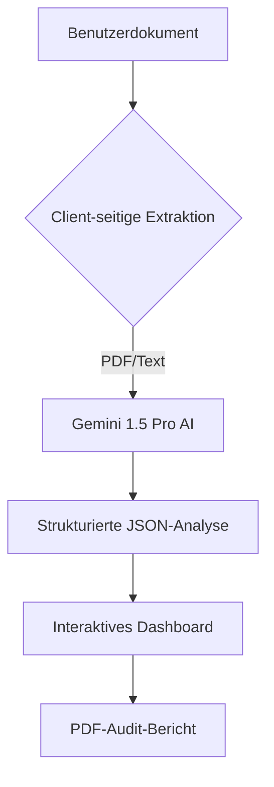

# SwissGuard AI - Smart Contract & Rechts-Auditor

Professionelles Tool zur Prüfung von Smart Contracts und Rechtsdokumenten mittels Gemini AI.

---
**Verfügbare Sprachen:**
[🇺🇸 English](./README.md) | [🇮🇹 Italiano](./README_IT.md) | [🇩🇪 Deutsch](./README_DE.md) | [🇫🇷 Français](./README_FR.md)
---

## 🛡️ Übersicht
SwissGuard AI bietet Analysen auf institutionellem Niveau für Rechtsdokumente und Blockchain-Smart-Contracts. Es identifiziert kritische Risiken, Compliance-Lücken und schlägt technische Korrekturen in Echtzeit vor.

## 📊 Systemarchitektur


## ✨ Hauptmerkmale
- **Mehrsprachige Unterstützung**: Benutzeroberfläche und Analyse auf Englisch, Italienisch, Deutsch und Französisch verfügbar.
- **Intelligente Erkennung**: Unterscheidet automatisch zwischen Rechtsdokumenten und Smart Contracts.
- **Compliance-Engine**: Prüfung gegen internationale Standards (DSGVO, FINMA usw.).
- **Risikobewertung**: Visuelle Risikoeinschätzung von 0 bis 100.
- **Exportierbare Berichte**: Professionelle PDF-Erstellung für den institutionellen Gebrauch.

## 🚀 Erste Schritte

Befolgen Sie diese Anweisungen, um das Projekt lokal einzurichten und auszuführen.

### Voraussetzungen
- **Node.js**: Version 18.0 oder höher.
- **npm**: Wird normalerweise mit Node.js installiert.

### Installation
1. **Repository klonen**:
   ```bash
   git clone https://github.com/ihr-benutzername/SwissGuardAI.git
   cd SwissGuardAI
   ```
2. **Abhängigkeiten installieren**:
   ```bash
   npm install
   ```

### Konfiguration (API-Schlüssel)
Um die KI-Audit-Funktionen nutzen zu können, benötigen Sie einen Google Gemini API-Schlüssel.
1. Holen Sie sich einen kostenlosen API-Schlüssel im [Google AI Studio](https://aistudio.google.com/app/apikey).
2. Erstellen Sie eine Datei namens `.env` im Hauptverzeichnis des Projekts.
3. Fügen Sie Ihren API-Schlüssel in die Datei ein:
   ```env
   GEMINI_API_KEY=ihr_tatsaechlicher_api_schluessel_hier
   ```

> [!NOTE]
> **Kostenlose vs. Erweiterte Version**: 
> - Die **Kostenlose Version** verwendet den in der `.env`-Datei angegebenen API-Schlüssel.
> - Die **Erweiterte Version** (in der AI Studio-Umgebung) ermöglicht die Auswahl verschiedener Schlüssel über die Benutzeroberfläche der Plattform. Für die lokale Nutzung verwenden beide Versionen den Schlüssel aus Ihrer `.env`-Datei.

### App starten
Starten Sie den Entwicklungsserver:
```bash
npm run dev
```
Öffnen Sie Ihren Browser und rufen Sie `http://localhost:3000` auf.

## 🚀 Bedienungsanleitung
1. **Sprache wählen**: Wählen Sie Ihre bevorzugte Sprache über das Globus-Symbol oben rechts.
2. **Dokument hochladen**: Ziehen Sie Ihre PDF- oder Quellcodedatei (.sol, .txt) in den Upload-Bereich.
3. **KI-Audit**: Das System extrahiert automatisch den Text und führt eine Tiefenanalyse durch.
4. **Ergebnisse prüfen**:
   - **Risiko-Score**: Überprüfen Sie das allgemeine Sicherheitsniveau.
   - **Compliance**: Überprüfen Sie die regulatorische Ausrichtung.
   - **Kritische Probleme**: Überprüfen Sie spezifische Klauseln und Lösungsvorschläge.
5. **Bericht herunterladen**: Klicken Sie auf die Schaltfläche "Bericht herunterladen", um eine professionelle PDF-Zusammenfassung zu speichern.

## 🛠️ Technische Details
- **Frontend**: React 19, Tailwind CSS, Motion.
- **KI**: Google Gemini 1.5 Pro.
- **PDF-Engine**: Client-seitiges PDF.js (umgeht Cookie-Beschränkungen in Iframes).
- **Sicherheit**: Keine serverseitige Speicherung von Dokumenten. Die Analyse erfolgt in Echtzeit.

## 📄 Lizenz
Dieses Projekt ist unter der MIT-Lizenz lizenziert - siehe die Datei [LICENSE](./LICENSE) für Details.
