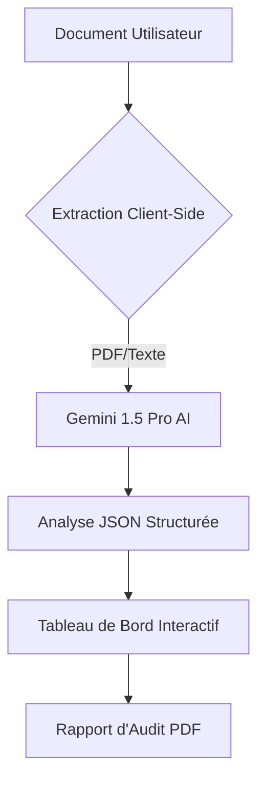

# SwissGuard AI - Auditeur de Smart Contracts et Documents Juridiques

Outil professionnel pour l'audit de smart contracts et de documents juridiques via l'IA Gemini.

---
**Langues Disponibles :**
[🇺🇸 English](./README.md) | [🇮🇹 Italiano](./README_IT.md) | [🇩🇪 Deutsch](./README_DE.md) | [🇫🇷 Français](./README_FR.md)
---

## 🛡️ Aperçu
SwissGuard AI propose une analyse de niveau institutionnel pour les documents juridiques et les smart contracts blockchain. Il identifie les risques critiques, les lacunes de conformité et suggère des corrections techniques en temps réel.

## 📊 Architecture du Système


## ✨ Caractéristiques Principales
- **Support Multilingue**: Interface et analyse disponibles en anglais, italien, allemand et français.
- **Détection Intelligente**: Distingue automatiquement les documents juridiques des smart contracts.
- **Moteur de Conformité**: Vérification par rapport aux normes internationales (RGPD, FINMA, etc.).
- **Score de Risque**: Évaluation visuelle du risque de 0 à 100.
- **Rapports Exportables**: Génération de PDF professionnels pour un usage institutionnel.

## 🚀 Guide de Démarrage

Suivez queste istruzioni per configurare ed eseguire il progetto localmente.

### Prérequis
- **Node.js**: Version 18.0 o superiore.
- **npm**: Solitamente incluso con Node.js.

### Installation
1. **Cloner le Repository**:
   ```bash
   git clone https://github.com/votre-nom-utilisateur/SwissGuardAI.git
   cd SwissGuardAI
   ```
2. **Installer les Dépendances**:
   ```bash
   npm install
   ```

### Configuration (Clé API)
Per utilizzare le funzioni di audit AI, è necessaria una chiave API di Google Gemini.
1. Obtenez une clé API gratuite sur [Google AI Studio](https://aistudio.google.com/app/apikey).
2. Créez un file chiamato `.env` nella directory principale del progetto.
3. Aggiungi la tua chiave API al file:
   ```env
   GEMINI_API_KEY=votre_cle_api_ici
   ```

> [!NOTE]
> **Version Gratuite vs Avancée**: 
> - La **Version Gratuite** utilizza la chiave API fornita nel file `.env`.
> - La **Version Avancée** (nell'ambiente AI Studio) permette di selezionare diverse chiavi tramite l'interfaccia della piattaforma. Per l'uso locale, entrambe le versioni utilizzeranno la chiave del file `.env`.

### Démarrage de l'App
Avvia il server di sviluppo:
```bash
npm run dev
```
Apri il browser e vai su `http://localhost:3000`.

## 🚀 Manuel d'Utilisation
1. **Sélectionner la Langue**: Choisissez votre langue préférée via l'icône du globe en haut à droite.
2. **Télécharger le Document**: Glissez-déposez votre fichier PDF ou le code source (.sol, .txt) dans la zone de téléchargement.
3. **Audit IA**: Le système extraira automatiquement le texte et effectuera une analyse approfondie.
4. **Examiner les Résultats**:
   - **Score de Risque**: Vérifiez le niveau de sécurité global.
   - **Conformité**: Vérifiez l'alignement réglementaire.
   - **Problèmes Critiques**: Examinez les clauses spécifiques et les corrections suggérées.
5. **Télécharger le Rapport**: Cliquez sur le bouton "Télécharger le rapport" pour enregistrer un résumé PDF professionnel.

## 🛠️ Détails Techniques
- **Frontend**: React 19, Tailwind CSS, Motion.
- **IA**: Google Gemini 1.5 Pro.
- **Moteur PDF**: PDF.js côté client (contourne les restrictions de cookies des iframes).
- **Sécurité**: Aucun stockage de documents côté serveur. L'analyse est effectuée à la volée.

## 📄 Licence
Ce projet est sous licence MIT - voir le fichier [LICENSE](./LICENSE) pour plus de détails.
