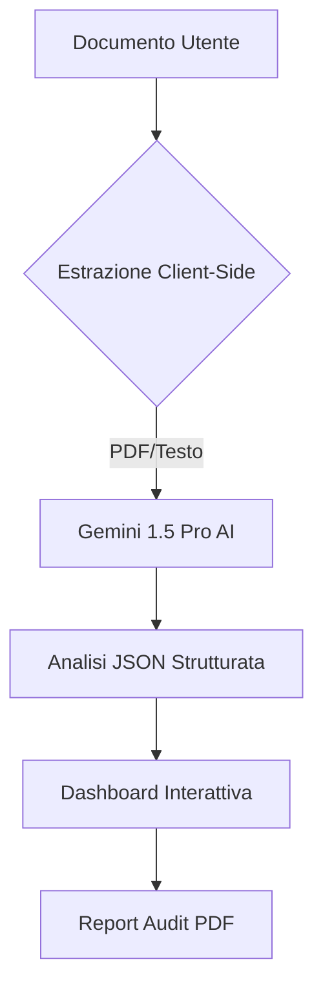

# SwissGuard AI - Audit di Smart Contract e Documenti Legali

Strumento professionale per l'audit di smart contract e documenti legali tramite l'intelligenza artificiale Gemini.

---
**Lingue Disponibili:**
[🇺🇸 English](./README.md) | [🇮🇹 Italiano](./README_IT.md) | [🇩🇪 Deutsch](./README_DE.md) | [🇫🇷 Français](./README_FR.md)
---

## 🛡️ Panoramica
SwissGuard AI offre analisi di livello istituzionale per documenti legali e smart contract blockchain. Identifica rischi critici, lacune di conformità e suggerisce correzioni tecniche in tempo reale.

## 📊 Architettura del Sistema


## ✨ Caratteristiche Principali
- **Supporto Multilingua**: Interfaccia e analisi disponibili in Inglese, Italiano, Tedesco e Francese.
- **Rilevamento Intelligente**: Distingue automaticamente tra Documenti Legali e Smart Contract.
- **Motore di Conformità**: Verifica rispetto agli standard internazionali (GDPR, FINMA, ecc.).
- **Punteggio di Rischio**: Valutazione visiva del rischio da 0 a 100.
- **Report Esportabili**: Generazione di PDF professionali per uso istituzionale.

## 🚀 Guida all'Avvio

Segui queste istruzioni per configurare ed eseguire il progetto localmente.

### Prerequisiti
- **Node.js**: Versione 18.0 o superiore.
- **npm**: Solitamente incluso con Node.js.

### Installazione
1. **Clona il Repository**:
   ```bash
   git clone https://github.com/tuo-username/SwissGuardAI.git
   cd SwissGuardAI
   ```
2. **Installa le Dipendenze**:
   ```bash
   npm install
   ```

### Configurazione (Chiave API)
Per utilizzare le funzioni di audit AI, è necessaria una chiave API di Google Gemini.
1. Ottieni una chiave API gratuita da [Google AI Studio](https://aistudio.google.com/app/apikey).
2. Crea un file chiamato `.env` nella directory principale del progetto.
3. Aggiungi la tua chiave API al file:
   ```env
   GEMINI_API_KEY=inserisci_qui_la_tua_chiave_api
   ```

> [!NOTE]
> **Versione Gratuita vs Avanzata**: 
> - La **Versione Gratuita** utilizza la chiave API fornita nel file `.env`.
> - La **Versione Avanzata** (nell'ambiente AI Studio) permette di selezionare diverse chiavi tramite l'interfaccia della piattaforma. Per l'uso locale, entrambe le versioni utilizzeranno la chiave del file `.env`.

### Avvio dell'App
Avvia il server di sviluppo:
```bash
npm run dev
```
Apri il browser e vai su `http://localhost:3000`.

## 🚀 Come Utilizzare
1. **Seleziona Lingua**: Scegli la lingua preferita dall'icona del globo in alto a destra.
2. **Carica Documento**: Trascina il tuo file PDF o il codice sorgente (.sol, .txt) nell'area di caricamento.
3. **Audit AI**: Il sistema estrarrà automaticamente il testo ed eseguirà un'analisi approfondita.
4. **Revisione Risultati**:
   - **Punteggio di Rischio**: Controlla il livello di sicurezza generale.
   - **Conformità**: Verifica l'allineamento normativo.
   - **Problemi Critici**: Esamina clausole specifiche e soluzioni suggerite.
5. **Scarica Report**: Clicca sul pulsante "Scarica Report" per salvare un riepilogo PDF professionale.

## 🛠️ Dettagli Tecnici
- **Frontend**: React 19, Tailwind CSS, Motion.
- **AI**: Google Gemini 1.5 Pro.
- **Motore PDF**: PDF.js lato client (evita le restrizioni sui cookie degli iframe).
- **Sicurezza**: Nessuna archiviazione dei documenti lato server. L'analisi viene eseguita istantaneamente.

## 📄 Licenza
Questo progetto è distribuito sotto Licenza MIT - vedi il file [LICENSE](./LICENSE) per i dettagli.
